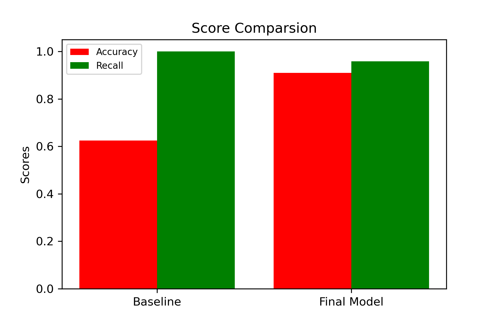

# Pediatric-Pneumonia-Image-Classification

# Overview

Chest X-ray images (anterior-posterior) were selected from retrospective cohorts of pediatric patients of one to five years old from Guangzhou Women and Children’s Medical Center, Guangzhou. All chest X-ray imaging was performed as part of patients’ routine clinical care.

For the analysis of chest x-ray images, all chest radiographs were initially screened for quality control by removing all low quality or unreadable scans. The diagnoses for the images were then graded by two expert physicians before being cleared for training the AI system. In order to account for any grading errors, the evaluation set was also checked by a third expert.


# Business Problem

We were then tasked with building a Convolutional Neural Network to classify the images by patterns in the photos given to us by the Guangzhou Women and Children’s Medical Center. This is to not only reduce costs by treating those who don't have the disease, but to also help save lives.  


# Data Understanding

We were given three different folders, a Train, Test, and Validation folder. Each section contained a different amount of photos, each labeled 'NORMAL' (0) and 'PNEUMONIA' (1). After viewing what the images looked like, to the naked untrained eye you are unable to tell the difference between effected lungs and healthy lungs, however computers look at images much differently. Assigning values to individual pixels instead of looking at the image as a whole. That being said using a CNN model we were able to identify the difference between them 91% of the time.


# Data Preperation & Analysis

After loading in the dataset, we labeled the two different types of images as Normal and Pneumonia, and then signed a binary classification for them (1,0). 

PNEUMONIA AND NORMAL LUNG IMAGE PLEASE

# Modeling

We built a baseline model, which just predicted the most frequent data type (in this case pneumonia plagued lungs). It had a low accuracy with a high recall. After that we started building a basic CNN model to see if it out performed, at first, with minimal layers and augmentation, there was not much change from the baseline. However after adding in extra hidden layers and augmentation to the model. We achieved a 91% accuracy with a ___ recall.


# Visualizations

This shows the difference between our final models scores and the baseline models scores.



# Conclusions

In conclusion, our model was 91% accurate. We chose this model due to its capabilities to determine the minor differences in photos that, to the naked eye, dont seem to have discernable features. After testing different augmentations and parameters in our model we believe we have come to the best model for the data that we currently have. With new data introduced to the model we could possibly further improve it with more time to train as well. We know that our model can not only help people, but also save the hospital money as well. 

# Next Steps

Like with every project, it is always crucial to gather more data to further improve the accuracy of our model. Also, branch out to other hospitals to work with their radiology teams. Working with different types of X-ray machines that might have slight alterations in how they print out photos might also be a good idea. Increasing our computational power to train our model more effectively to increase accuracy and recall. 


```
├── README.md                 <- The top-level README for reviewers of this project
├── final_notebook.ipynb       <- Narrative documentation of analysis in Jupyter notebook
├── presentation.pdf          <- PDF version of project 
├── images                    <- Generated from code
├── data                      <- Older notebooks, kept to see progress
```# Pediatric-Pneumonia-Image-Classification

