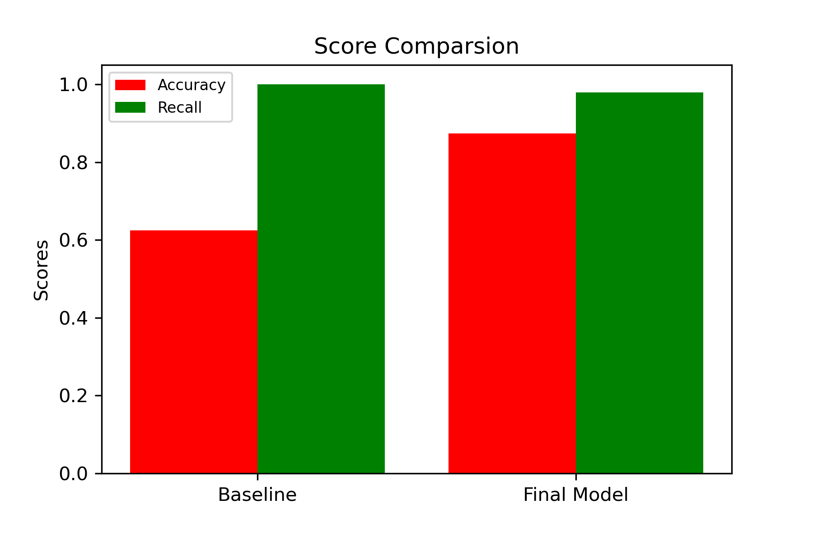

# Pediatric-Pneumonia-Image-Classification

# Overview

Chest X-ray images (anterior-posterior) were selected from retrospective cohorts of pediatric patients of one to five years old from Guangzhou Women and Children’s Medical Center, Guangzhou. All chest X-ray imaging was performed as part of patients’ routine clinical care.

For the analysis of chest x-ray images, all chest radiographs were initially screened for quality control by removing all low-quality or unreadable scans. The diagnoses for the images were then graded by two expert physicians before being cleared for training the AI system. To account for any grading errors, the evaluation set was also checked by a third expert.


# Business Problem & Understanding

We were then tasked with building a Convolutional Neural Network to classify the images by patterns in the photos given to us by the Guangzhou Women and Children’s Medical Center from the RSNA (Radiological Society of North America). This is to not only reduce costs by treating those who don't have the disease but also help save lives.  

According to the World Health Organization(WHO), Pneumonia is the single largest infectious cause of death in children worldwide. Pneumonia killed 740 180 children under the age of 5 in 2019, accounting for 14% of all deaths of children under five years old but 22% of all deaths in children aged 1 to 5. Pneumonia affects children and families everywhere, but deaths are highest in South Asia and sub-Saharan Africa. Children can be protected from pneumonia, it can be prevented with simple interventions, and treated with low-cost, low-tech medication and care. Pneumonia in the pediatric population can be caused by various bacteria and viruses which sometimes may be age-specific. Neonates are at risk for bacterial pathogens present in the birth canal. Viruses are the main cause of pneumonia in older infants and toddlers between 30 days and 2 years old. In children 2 to 5 years old, respiratory viruses are also the most common.

In this project, we developed a neural network model to predict whether a chest x-ray image has pneumonia or not using artificial intelligence algorithms. The model output from this project can be used to support the diagnosis of pneumonia by radiologists and medical professionals.


# Data Understanding

We were given three different folders, a Train, Test, and Validation folder. Each section contained a different amount of photos, each labeled 'NORMAL' (0) and 'PNEUMONIA' (1). After viewing what the images looked like, to the naked untrained eye you are unable to tell the difference between affected lungs and healthy lungs, however, computers look at images much differently. Assigning values to individual pixels instead of looking at the image as a whole. That being said using a CNN model we were able to identify the difference between the 91% of the time.

The data we used in this modeling was initially stored at Mendeley Data, a secure cloud-based repository by Kermany et al,2018 (Kermany Daniel; Zhang, Kang; Goldbaum, Michael (2018), “Labeled Optical Coherence Tomography (OCT) and Chest X-Ray Images for Classification”, Mendeley Data, V2, doi: 10.17632/rscbjbr9sj.2) and is available on kaggle. [Data](https://www.kaggle.com/andrewmvd/pediatric-pneumonia-chest-xray?select=Pediatric+Chest+X-ray+Pneumonia).


# Data Preperation & Augmentation

After loading in the dataset, we labeled the two different types of images as Normal and Pneumonia, and then signed a binary classification for them (1,0). 

Our first models were created using the initially generated datasets, after training these models we then realized we would need to perform data augmentation to produce quality results. We conduct a variety of augmentations utilizing the ImageDataGenerator. Augmentation was only performed on the train_set, again withholding 20% from the validation set. This augmented data set was then used to train subsequent models in our final network.


# Modeling

We built a baseline model, which just predicted the most frequent data type (in this case pneumonia plagued lungs). It had a low accuracy with a high recall. After that we started building a basic CNN model to see if it outperformed, at first, with minimal layers and augmentation, there was not much change from the baseline. However, after adding in extra hidden layers and augmentation to the model. We achieved a 91% accuracy with a ___ recall.

For our first iteration of the neural network model we only used Dense network layers to see if we could improve from the dummy model. Our final activation layer will be sigmoid for all future models as we are predicting a binary classification. We will also use binary cross-entropy as our loss function because of this. The Adam optimizer was chosen as it is well known to perform the best for image classification. The input shape matches the image resizing we did in the data generation step. While the simple performed well on the train data, as well as the validation data, it did not on the test data and we still have a high amount of false predictions. Our model is heavily overfitted as we would expect from a simple dense network. We will attempt to add in convolutional layers to improve the model and reduce overfitting.

We wanted to see if a change in the activation function has an impact on the accuracy and recall scores. Therefore, we tried the 'LeakyReLU' activation function on the fifth CNN model instead of 'relu' which we used on the fourth CNN model. The result indicated an increase in accuracy but decreased the recall score. Since our objective is mainly to increase the recall score, while maintaining a relatively higher accuracy score, we intend to use the 'relu' activation but not the 'LeakyReLU'. We felt that the slight trade-off between lower accuracy and higher recall score is justifiable in the context of classifying pneumonia to reduce the number of false-negative results. This helps to minimize the number of patients who have pneumonia but are diagnosed as normal or healthy. This also helps to increase the number of correctly diagnosed pneumonic patients using chest X-rays.

# Visualizations

This shows the difference between our final models' scores and the baseline models' scores.



# Conclusions

In conclusion, our model was 91% accurate. We chose this model due to its capabilities to determine the minor differences in photos that, to the naked eye, don't seem to have discernable features. After testing different augmentations and parameters in our model we believe we have come to the best model for the data that we currently have. With new data introduced to the model, we could further improve it with more time to train as well. We know that our model can not only help people but also save the hospital money as well. 

# Next Steps

Like with every project, it is always crucial to gather more data to further improve the accuracy of our model. Also, branch out to other hospitals to work with their radiology teams. Working with different types of X-ray machines that might have slight alterations in how they print out photos might also be a good idea. Increasing our computational power to train our model more effectively to increase accuracy and recall. 


```
├── README.md                 <- The top-level README for reviewers of this project
├── final_notebook.ipynb       <- Narrative documentation of analysis in Jupyter notebook
├── presentation.pdf          <- PDF version of project 
├── images                    <- Generated from code
├── data                      <- Older notebooks, kept to see progress
```# Pediatric-Pneumonia-Image-Classification

